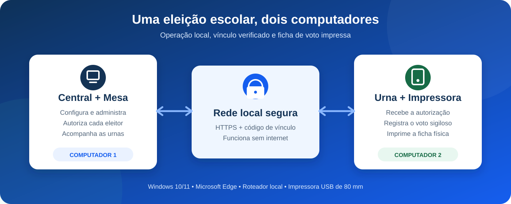
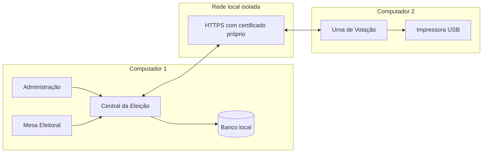
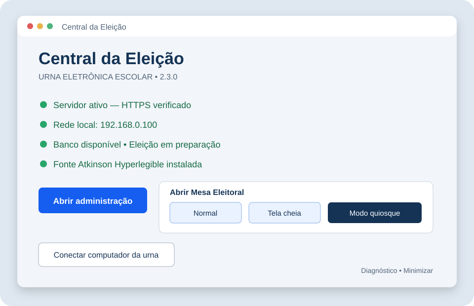
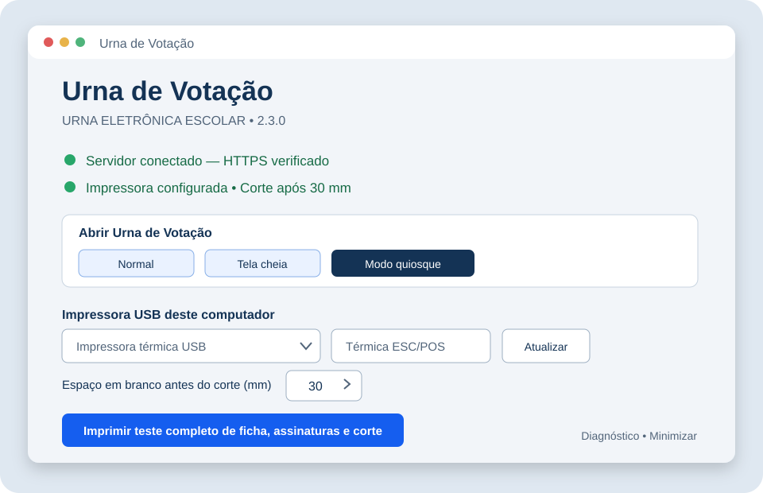

<div align="center">

# Urna Eletrônica Escolar

### Sistema local para organizar eleições estudantis com dois computadores e ficha de voto impressa

[](https://github.com/arturcardoalves/Urna-Eletronica-Escolar/actions/workflows/build-windows-installer.yml)


[Instalação e uso](docs/GUIA_2.3.0.md) · [Gerar o instalador](docs/GERAR_EXE_NO_GITHUB.md) · [Segurança](SEGURANCA.md) · [Versões](docs/CHANGELOG.md) · [Revisão técnica](docs/REVISAO_CODIGO.md)

</div>



## Sobre o projeto

A **Urna Eletrônica Escolar** ajuda escolas a realizar eleições de grêmio, representantes de turma e outras consultas estudantis em uma rede local. O sistema separa a operação em dois computadores Windows:

- **Central + Mesa Eleitoral:** configura a eleição, cadastra chapas e eleitores, autoriza cada votação e acompanha as urnas.
- **Urna de Votação:** recebe a liberação da Mesa, mostra as opções ao eleitor e imprime a ficha física em uma impressora USB.

O mesmo instalador `Instalar_Urna_Escolar_2.3.0.exe` atende os dois computadores. Durante a instalação, o responsável escolhe qual papel aquele equipamento terá.

> [!IMPORTANT]
> Este é um projeto educacional para eleições escolares. Ele não é uma urna oficial, não possui hardware eleitoral certificado e não deve ser apresentado como substituto de sistemas oficiais de votação.

## Como funciona



1. A escola instala o mesmo EXE nos dois computadores e escolhe o papel de cada um.
2. Os computadores são ligados por cabo às portas LAN do mesmo roteador, com DHCP habilitado.
3. A Central cadastra a eleição, chapas, integrantes, eleitores e usuários da Mesa.
4. A Urna localiza a Central automaticamente. O vínculo exige aprovação e comparação de um código nos dois computadores.
5. A Mesa autoriza um eleitor por vez. A Urna recebe somente a autorização necessária para aquela votação.
6. O eleitor confirma o voto. O sistema registra o voto sem nome ou matrícula e envia a ficha para a impressora da Urna.
7. Na abertura e no encerramento são produzidos documentos de conferência, como zerésima e boletim de urna.

## Interfaces

As imagens abaixo representam a interface atual do aplicativo Windows. Mesa, Administração e tela de votação são abertas no Microsoft Edge em modo **Normal**, **Tela cheia** ou **Quiosque**.

<table>
  <tr>
    <td width="50%"></td>
    <td width="50%"></td>
  </tr>
  <tr>
    <td align="center"><strong>Central da Eleição</strong><br>Servidor, Administração, Mesa e conexão das urnas.</td>
    <td align="center"><strong>Urna de Votação</strong><br>Conexão, impressora, margem de corte e abertura da cabine.</td>
  </tr>
</table>

## Principais características

| Área | Recursos |
|---|---|
| Administração | Configuração da eleição, chapas, integrantes, eleitores, turmas, turnos e usuários |
| Mesa Eleitoral | Autorização individual, acompanhamento das urnas e intervenção em falhas de impressão |
| Votação | Interface simples, confirmação do voto, votos em branco quando habilitados e bloqueio de repetição |
| Impressão | Ficha em papel de 80 mm, zerésima, boletim de urna, modo Driver Windows ou ESC/POS |
| Corte | Margem configurável de 10 a 80 mm, padrão de 30 mm e teste de ficha/assinaturas |
| Operação | Abertura Normal, Tela cheia ou Quiosque para Mesa e Urna |
| Rede | Descoberta automática na LAN, reconexão quando o IP muda e funcionamento sem internet |
| Auditoria | Hashes de configuração, cadeia de votos, documentos de conferência e registros operacionais |
| Recuperação | Diário contra impressão duplicada, reimpressão somente autorizada e backup em atualização |
| Acessibilidade | Fonte Atkinson Hyperlegible e botões grandes para operação escolar |

## Segurança e privacidade

| Controle | Como é aplicado |
|---|---|
| Comunicação | HTTPS na porta 8443 com autoridade certificadora criada pela própria instalação |
| Vínculo | Aprovação administrativa e código de verificação ligado ao certificado da Central |
| Rede | Regras de firewall limitadas à sub-rede local; uso recomendado sem internet e sem Wi-Fi |
| Credencial da Urna | Protegida pelo Windows para o usuário local atual |
| Sigilo | O voto armazenado não contém nome, matrícula ou horário do eleitor |
| Impressão | O diário guarda identificadores opacos e estados, sem registrar a escolha impressa |
| Integridade | Hashes e cadeia de auditoria ajudam a identificar alterações nos dados |
| Atualização | Bloqueada durante eleição lacrada ou aberta; backup criado antes da substituição |

Segurança também depende do ambiente físico. Restrinja contas administrativas, guarde os computadores e comprovantes, mantenha data e hora corretas e realize uma eleição completa de teste. Consulte [SEGURANCA.md](SEGURANCA.md) para limites e recomendações.

## Requisitos

- Dois computadores com Windows 10 ou Windows 11 de 64 bits.
- Microsoft Edge instalado nos dois computadores.
- Um roteador com DHCP e duas portas LAN; internet não é necessária durante a eleição.
- Cabos de rede para os dois computadores.
- Impressora USB instalada somente no computador da Urna.
- Papel compatível com a impressora; o projeto usa layouts de 80 mm.
- Fontes Atkinson Hyperlegible Regular e Bold.
- Conta com permissão de administrador apenas para instalar e configurar firewall/certificado.

## Instalação rápida

1. Baixe o artefato **Instalador-Urna-Escolar-2.3.0** na execução aprovada do [GitHub Actions](https://github.com/arturcardoalves/Urna-Eletronica-Escolar/actions).
2. No primeiro computador, execute o EXE e escolha **Central da Eleição + Mesa Eleitoral**.
3. No segundo, execute o mesmo EXE e escolha **Urna de votação + impressora USB**.
4. Ligue os dois computadores ao mesmo roteador e abra a Central.
5. Na Central, permita a conexão; na Urna, procure a Central e compare os códigos.
6. Selecione a impressora na Urna, ajuste a margem de corte e execute o teste completo.
7. Faça uma eleição de teste antes de cadastrar ou lacrar a eleição real.

O procedimento completo está no [Guia de instalação e uso](docs/GUIA_2.3.0.md).

## Versões

| Versão | Situação | Destaques |
|---|---|---|
| **2.3.0** | Atual | Instalador unificado, impressão nativa, HTTPS corrigido, modos Normal/Tela cheia/Quiosque, ajuste de corte e pacote limpo |
| **2.2.1** | Legada | Base anterior com lançadores e processos separados; os documentos e scripts antigos foram substituídos pelo fluxo unificado |

As alterações conhecidas estão registradas em [docs/CHANGELOG.md](docs/CHANGELOG.md). O projeto ainda não possui uma tag de release; a versão confiável deve vir de uma execução aprovada do workflow.

## Gerar o instalador

O workflow oficial usa Windows e Python 3.13, executa os testes e publica o instalador como artefato:

1. Envie o código para a branch `main`.
2. Abra **Actions → Build Windows Installer**.
3. Aguarde todas as etapas ficarem verdes.
4. Baixe **Instalador-Urna-Escolar-2.3.0**.
5. Extraia `Instalar_Urna_Escolar_2.3.0.exe` e confira o hash SHA-256.

Para compilar localmente, com Python 3.13 x64 e Inno Setup 6:

```powershell
powershell.exe -NoProfile -ExecutionPolicy Bypass -File .\installer\BUILD_WINDOWS.ps1
```

Saída: `installer/output/Instalar_Urna_Escolar_2.3.0.exe`. Veja [GERAR_EXE_NO_GITHUB.md](docs/GERAR_EXE_NO_GITHUB.md) para os comandos de envio, download e hash.

## Estrutura do repositório

```text
.
├── .github/workflows/       # Build e testes no GitHub Actions
├── installer/               # Aplicativo Windows, proteção de atualização e instalador
├── tests/                   # Integração, TLS, votação, impressão e recuperação
├── docs/                    # Guias, histórico e revisão técnica
├── URNA_ESCOLAR_SOURCE/
│   ├── 01_SERVIDOR_ADMIN/   # API, banco, Administração, Mesa e Urna web
│   └── 03_URNA/             # Biblioteca de impressão
└── SEGURANCA.md             # Modelo de segurança e limites
```

Arquivos de build, ambientes Python, executáveis, bancos, chaves, certificados, logs e dados reais ficam fora do Git. Nunca envie ao repositório dados de uma eleição.

## Qualidade e testes

O projeto possui **38 testes automatizados**. Eles cobrem votação completa, concorrência, vínculo, autenticação, impressão e reimpressão, atualização protegida, certificados TLS, consistência da versão, modos do Edge e margem antes do corte. O workflow também faz testes do executável empacotado em um Windows temporário.

Testes automatizados não comprovam o funcionamento físico do roteador, cabos, driver, impressora, papel ou guilhotina. Antes da eleição oficial, teste os dois computadores e percorra abertura, votação, falha de papel, recuperação e encerramento.

## Documentação

- [Guia de instalação e operação](docs/GUIA_2.3.0.md)
- [Como enviar ao GitHub e gerar o EXE](docs/GERAR_EXE_NO_GITHUB.md)
- [Histórico de versões](docs/CHANGELOG.md)
- [Segurança e privacidade](SEGURANCA.md)
- [Auditoria das funções preservadas](docs/AUDITORIA_FUNCOES_2.3.0.md)
- [Correção de HTTPS](docs/CORRECAO_HTTPS.md)
- [Revisão do código e validações](docs/REVISAO_CODIGO.md)

## Estado do projeto

O sistema está em desenvolvimento e validação para uso escolar. A versão 2.3.0 deve passar pelo GitHub Actions e por uma eleição física de teste antes de ser usada. Relate problemas com passos para reproduzir, versão instalada, papel da máquina e mensagens do Diagnóstico, sem anexar banco, credenciais, chaves ou dados de eleitores.
